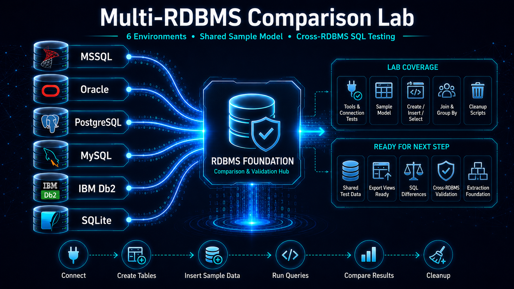

# Multi-RDBMS Comparison Lab



Ez a repository egy gyakorlati SQL- és RDBMS-összehasonlító labor.

A projekt célja, hogy ugyanazokat az alapvető SQL-műveleteket több különböző relációs adatbázis-kezelő rendszerben is kipróbáljam. A fókusz nem a telepítési folyamat dokumentálásán van, hanem azon, hogy a különböző adatbázisokhoz sikeresen tudjak csatlakozni, SQL-t futtatni, táblákat létrehozni, adatokat betölteni, majd az SQL-szintaktikai és működésbeli eltéréseket összehasonlítani.

## Használt adatbázisok és eszközök

| Adatbázis            | Kezelőeszköz                    |
| -------------------- | ------------------------------- |
| Oracle Database      | Toad for Oracle                 |
| Microsoft SQL Server | SQL Server Management Studio 22 |
| PostgreSQL           | pgAdmin                         |
| MySQL                | MySQL Workbench                 |
| IBM Db2              | DBeaver, Db2 Docker konténer    |
| SQLite               | DBeaver                         |

A SQLite külön szerepet kap a projektben. Nem klasszikus szerver alapú adatbázis-kezelő, hanem fájlalapú, beágyazott SQL-adatbázis. Emiatt nem váltja ki az Oracle, SQL Server, PostgreSQL, MySQL vagy Db2 rendszereket, hanem kiegészítő összehasonlításként szerepel.

## Dokumentáció

A részletes magyar dokumentáció külön fájlokban található a `docs/` mappában.

| Dokumentum                                                                               | Tartalom                                                                                                      |
| ---------------------------------------------------------------------------------------- | ------------------------------------------------------------------------------------------------------------- |
| [`docs/01_tools_and_connection_tests.md`](docs/01_tools_and_connection_tests.md)         | Használt adatbázis-kezelő eszközök, kapcsolódási tesztek, alap dátum/idő lekérdezések                         |
| [`docs/02_sample_model_and_sql_execution.md`](docs/02_sample_model_and_sql_execution.md) | Egységes `customers` / `orders` mintaadatmodell, CREATE, INSERT, SELECT, JOIN, GROUP BY és cleanup futtatások |
| [`docs/03_rdbms_differences.md`](docs/03_rdbms_differences.md)                           | RDBMS-enkénti SQL eltérések összefoglalása                                                                    |

Angol rövid összefoglaló:

- [`README-en.md`](README-en.md)

## Mappaszerkezet

```text
multi-rdbms-comparison-lab/
│
├── README.md
├── README-en.md
│
├── docs/
│   ├── 01_tools_and_connection_tests.md
│   ├── 02_sample_model_and_sql_execution.md
│   └── 03_rdbms_differences.md
│
├── images/
│   ├── 00_project_hero/
│   ├── 01_tools_and_connection_tests/
│   └── 02_sample_model_and_sql_execution/
│       ├── oracle/
│       ├── sqlserver/
│       ├── postgresql/
│       ├── mysql/
│       ├── db2/
│       └── sqlite/
│
└── sql/
    ├── 01_connection_tests/
    └── 02_sample_model/
        ├── oracle/
        ├── sqlserver/
        ├── postgresql/
        ├── mysql/
        ├── db2/
        └── sqlite/
```

## SQL fájlok

A kapcsolattesztek SQL fájljai:

```text
sql/01_connection_tests/
├── oracle.sql
├── sqlserver.sql
├── postgresql.sql
├── mysql.sql
├── db2.sql
└── sqlite.sql
```

Az egységes mintaadatmodell SQL fájljai:

```text
sql/02_sample_model/<adatbazis>/
├── 02_create_tables.sql
├── 03_insert_sample_data.sql
├── 04_basic_selects.sql
├── 05_joins_and_group_by.sql
└── 06_cleanup.sql
```

## Jelenlegi állapot

A projekt jelenlegi állapotában mind a hat környezetben megtörtént:

- adatbázis-kezelő eszköz megnyitása;
- kapcsolódási / alap SQL teszt;
- `customers` és `orders` táblák létrehozása;
- mintaadatok beszúrása;
- alap SELECT lekérdezések futtatása;
- JOIN és GROUP BY lekérdezések futtatása;
- cleanup script kipróbálása.

## Megjegyzés

Ez egy tanulási és portfólió célú laborprojekt. A képernyőképek saját, lokális laborkörnyezeteket és tesztadatbázisokat mutatnak. A repository nem tartalmaz éles adatot, jelszót, tokent vagy érzékeny információt.

## Kapcsolódó projekt

Ez a repository az RDBMS-alapozó és összehasonlító labor szerepét tölti be. A több adatbázis-kezelőből történő adatkinyerés külön folytatásként, önálló projektben jelenik meg:

- [multi-rdbms-data-extraction-lab](https://github.com/gergelyhajdu/multi-rdbms-data-extraction-lab)
